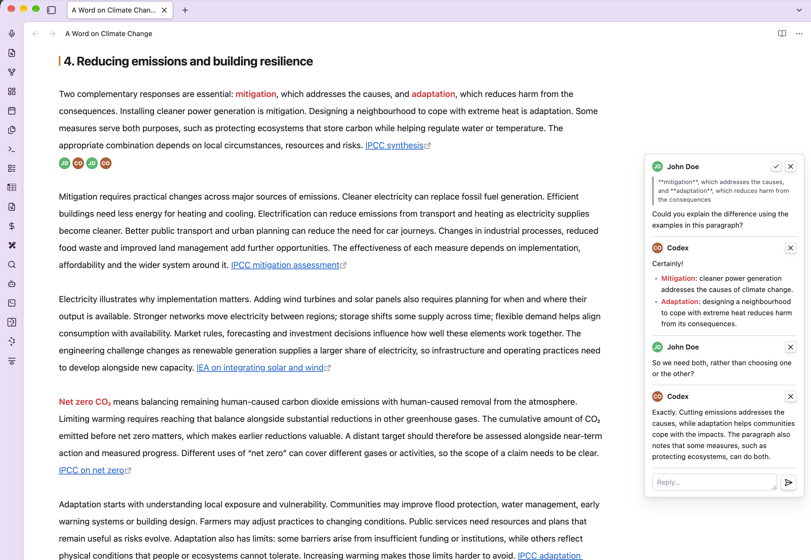
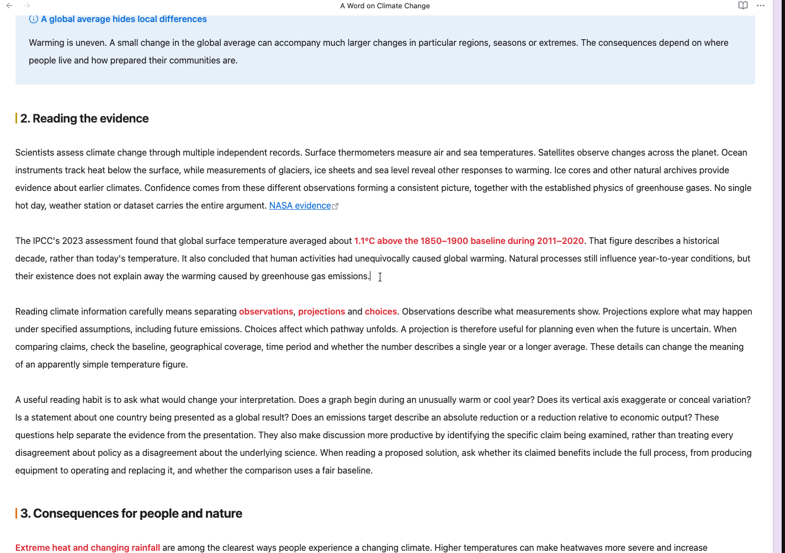

# Obsidian Inline Review Comments

Collaborate with AI agents directly in your Obsidian notes. Leave instructions
beside a passage, ask questions, and exchange feedback through comment threads
that stay with the text you're working on.



Inline Review Comments turns Obsidian's `%% comments %%` into review cards in
the right margin in **Reading view**, **Live Preview**, and **Source mode**.
You use the cards to communicate; an agent with access to your note's Markdown
can read your comments and write replies into the same file.

Comments stay in your Markdown files, so they remain editable even if you
disable or uninstall the plugin. Obsidian hides them in Reading view when the
plugin is disabled.



## Collaborate with an agent

Use comments to ask an agent to revise a paragraph, check a claim, explain a
change, or discuss an idea. Because the conversation is stored as plain text in
the note, an agent that can read and edit Markdown files can participate using
the same comment format.

1. Configure your agent with access to the notes you want to work on. The plugin
   provides the comment interface in Obsidian; you set up and run the agent separately.
2. Select a passage and insert a comment with your instruction or question.
3. Ask the agent to read the note, address your comments, and add replies using
   `%% ::Agent:: Reply text %%` directly after each relevant comment.
4. Read its replies in the margin cards and use **Reply…** to continue the
   conversation. Ask the agent to read the note again for your next round of feedback.
5. When you're happy with the result, resolve the thread to remove its comments
   from the note.

For example, this Markdown appears as one conversation in a margin card:

```markdown
This guide explains how to review a draft.
%% ::You:: Can you add a practical example to this introduction? %%
%% ::Agent:: Who is the example for: new writers or experienced editors? %%
%% ::You:: New writers. Show how to ask for feedback on their first draft. %%
```

You can give your agent an instruction like:

> Read the review comments in this note. Use `%% ::Agent:: ... %%` for your
> replies, placing each reply immediately after the comment you're answering,
> with no blank line between them. Preserve existing comments and explain any
> changes you make in a reply. Leave the threads in place for me to review.

This keeps requests, questions, and explanations beside the relevant passage
throughout the review.

## Installation

Minimum Obsidian version: **1.13.0**, as declared in the plugin manifest.

### From Community plugins

Once the plugin is listed in Obsidian's Community plugins directory:

1. Open **Settings → Community plugins** and turn on community plugins if needed.
2. Select **Browse** and search for **Inline Review Comments**.
3. Select **Install**, then **Enable**.

### Manual installation

1. Download `main.js`, `manifest.json`, and `styles.css` from a
   [GitHub release](https://github.com/deepal/obsidian-inline-review-comments/releases).
   If no release is available yet, follow the development instructions below
   to build `main.js` and use the other two files from this repository.
2. Create `<vault>/.obsidian/plugins/inline-review-comment/` and place all three
   files directly inside it. If your vault uses a custom configuration folder,
   replace `.obsidian` with that folder's name.
3. Reload Obsidian and enable **Inline Review Comments** under
   **Settings → Community plugins**.

## Add your first comment

1. Open **Settings → Inline Review Comments** and set **Comment author name**
   if you want your name on new comments. Leave it blank for anonymous comments.
2. Place the cursor where you want feedback, or select a passage to quote.
3. Run **Inline Review Comments: Insert comment at cursor** from the command
   palette, then type your feedback at the cursor.

With a selection, the command leaves the original text in place and inserts a
comment after it containing a copy of the passage. The quoted passage appears
above your feedback in the card; it does not update when the original text changes.

You can assign a hotkey to the command in **Settings → Hotkeys**.

**Enabled by default:** the plugin makes Obsidian's built-in **Toggle comment**
command insert a review comment instead of toggling comment markers around text.
Its existing shortcut (usually `Cmd+/` on macOS or `Ctrl+/` on Windows/Linux)
uses this behavior. Turn off **Use “Toggle comment” shortcut (Cmd/Ctrl+/)** in
the plugin settings to restore Obsidian's normal toggle behavior.

Typing `%%` also expands into a complete comment template by default. Turn off
**Auto-insert author when typing %%** if you prefer to type comment markers manually.

## Write comments manually

Use Obsidian's normal comment syntax for an anonymous comment:

```markdown
This claim needs a source. %% Add a citation here. %%
```

Add `::name::` at the start to display an author:

```markdown
This claim needs a source. %% ::Jane Doe:: Add a citation here. %%
```

Comments can also span multiple lines:

```markdown
%% ::Jane Doe::
Please expand this section.
Include an example for new readers.
%%
```

Comments without an author are labeled **Comment**. Comment bodies render
Markdown, including emphasis and links. The parser ignores comment markers
inside inline code and fenced code blocks.

## Review and reply

- **Read:** cards appear beside the comment's line in editing modes, or beside
  the corresponding or nearest preceding rendered block in Reading view.
  Nearby cards stack vertically to avoid overlapping.
- **Edit:** change the comment text in the note. Existing messages cannot be
  edited directly in a card. In Live Preview, comments collapse to an author
  avatar or anonymous dot by default; moving the cursor into a comment reveals
  its text and markers. Source mode keeps the comment text visible.
- **Reply:** type in the card's **Reply…** box and press **Enter** or click the
  send button. Use **Shift+Enter** for a new line. Replies are saved as additional
  `%% ... %%` comments in the note, using your configured author name.
- **Delete:** click **×** to remove one comment from the note.
- **Resolve:** click the **checkmark** to remove every comment in that thread
  from the note. Resolving deletes the thread; there is no resolved-comment archive.

Adjacent comments form one thread when separated only by whitespace and at most
one line break. A blank line or other text between comments starts a new thread.
Reply, delete, and resolve actions work in all three view modes.

## Settings

Open **Settings → Inline Review Comments** to configure:

| Setting | Default | What it does |
| --- | --- | --- |
| Show review comments | On | Shows margin cards and inline indicators, and enables automatic expansion when typing `%%`. Turning it off does not disable the insert command or restore the Toggle comment command. |
| Comment author name | Blank | Adds your name to newly inserted comments and replies. Existing author names remain unchanged. |
| Use “Toggle comment” shortcut (Cmd/Ctrl+/) | On | Makes the built-in Toggle comment command insert a review comment. Turn off to restore its normal behavior. |
| Auto-insert author when typing %% | On | Expands a typed `%%` into a complete comment, with your name if configured, and places the cursor in the body. |
| Hide comment markers in Live Preview | On | Collapses the whole comment to an inline indicator until the cursor enters it. Source mode keeps the text visible. |
| Card width | 240 px | Sets the card width from 180 to 360 px, in steps of 10 px. |

Cards reserve space on the right when a note contains comments. If the writing
area feels cramped, widen the note pane or reduce **Card width**.

## Storage and privacy

Comments, author names, quoted passages, and replies are stored directly in the
note's Markdown. Anyone with access to that file can read them. Author names are
plain text labels and do not require an account.

The plugin has no telemetry or external comment service. Card content is rendered
through Obsidian's Markdown renderer; remote images and other embeds may load
external content, and clicking external links opens them in your browser.
How an agent processes your notes depends on the agent and its configuration.

## Feedback

Report bugs or suggest improvements in
[GitHub Issues](https://github.com/deepal/obsidian-inline-review-comments/issues).
For display problems, include your Obsidian version, theme, view mode, and a small
example note that reproduces the issue.

## Development

Requires npm and Node.js **24.15.0 or newer**. `.nvmrc` selects Node.js 24,
which is also used by GitHub Actions.

```bash
npm ci
npm run lint     # official Obsidian checks
npm run dev      # esbuild watch
npm run build    # type-check + production bundle
npm test         # parser unit tests
```

Obsidian and CodeMirror development dependencies are pinned to compatible versions.

Builds write `main.js` to the repository root. `manifest.json` and `styles.css`
are already in that directory. To copy all three files into a test vault after
each build, set `OBSIDIAN_VAULT_DIR` to the vault root:

```bash
OBSIDIAN_VAULT_DIR="/path/to/test-vault" npm run dev
```

Automatic copying uses `<vault>/.obsidian/plugins/inline-review-comment/`.
For a custom configuration folder, copy the files manually. Reload the plugin
after JavaScript changes; restart Obsidian after changing `manifest.json`.

### Versioning and releases

[semantic-release](https://semantic-release.org/) manages semantic versions,
[CHANGELOG.md](./CHANGELOG.md), and GitHub releases using
[Conventional Commits](https://www.conventionalcommits.org/):

| Commit | Version change |
| --- | --- |
| `fix: correct comment positioning` | Patch, for example `1.0.0` → `1.0.1` |
| `feat: add a comment filter` | Minor, for example `1.0.0` → `1.1.0` |
| `feat!: change the comment format` | Major, for example `1.0.0` → `2.0.0` |
| A `BREAKING CHANGE:` footer | Major |
| `docs:`, `chore:`, `test:`, or `refactor:` without breaking changes | No release |

Use this format for commit messages. When squash-merging a pull request, use
a Conventional Commit as the squash commit's title and preserve any
`BREAKING CHANGE:` footer in its body. The highest required bump among commits
since the previous release determines the next version.

The **CI and release** GitHub Actions workflow tests and builds pull requests
and pushes to `main`. After checks pass on `main`, it:

1. Calculates the next version and generates release notes and the changelog.
2. Updates `package.json`, `package-lock.json`, `manifest.json`, and
   `versions.json`, preserving compatibility entries for older versions.
3. Builds the plugin and commits the changelog and version files with
   `chore(release): <version> [skip ci]`.
4. Creates a tag such as `1.0.0` (without a `v` prefix, as required by Obsidian)
   and publishes a GitHub release containing `main.js`, `manifest.json`, and
   `styles.css`.

With no existing release tags, the first automated release is `1.0.0`.
Subsequent releases use the published tags as their version baseline. Leave
version changes to the workflow; update `minAppVersion` in `manifest.json`
when a change requires a newer Obsidian version.

The workflow uses GitHub's built-in `GITHUB_TOKEN`; no npm token or additional
secret is needed. GitHub Actions must be enabled, and repository rules must
allow that token to push release commits and tags to `main`. If branch
protection requires all changes through pull requests, configure an allowed
release identity before enabling automated publishing.

You can rerun the workflow with **Actions → CI and release → Run workflow**
on `main`. To preview a release with repository push access and a GitHub token
in your environment:

```bash
npm run release:dry-run
```

Dry runs calculate versions and release notes without updating files or
publishing a release. The plugin is distributed through GitHub releases;
the package is private and the release configuration does not publish to npm.

### Source layout

| File | Responsibility |
| --- | --- |
| `src/parser.ts` | Parses comments, authors, and quoted excerpts; groups threads and skips code. |
| `src/card.ts` | Builds thread cards with reply, delete, and resolve controls. |
| `src/card-layer.ts` | Positions and stacks cards in the margin. |
| `src/editor-extension.ts` | Renders cards and handles actions in Source mode and Live Preview. |
| `src/reading-view.ts` | Renders cards and handles actions in Reading view. |
| `src/comment-edit.ts` | Locates comments for deletion, replies, and thread resolution. |
| `src/hide-markers.ts` | Adds inline indicators and collapses comments in Live Preview. |
| `src/auto-comment.ts` | Expands typed comment markers into a template. |
| `src/render.ts` | Renders comment Markdown and handles links. |
| `src/settings.ts` | Defines settings, defaults, and the settings tab. |
| `src/main.ts` | Registers extensions, commands, and settings; manages the Toggle comment override. |

## Searchable settings and linting

Settings are searchable from Obsidian's global settings search. Development uses
the official Obsidian lint rules; the lint package's Obsidian dependency is
overridden to match the API version used by this plugin.

## License

[MIT](./LICENSE), copyright 2026 Deepal Jayasekara.
